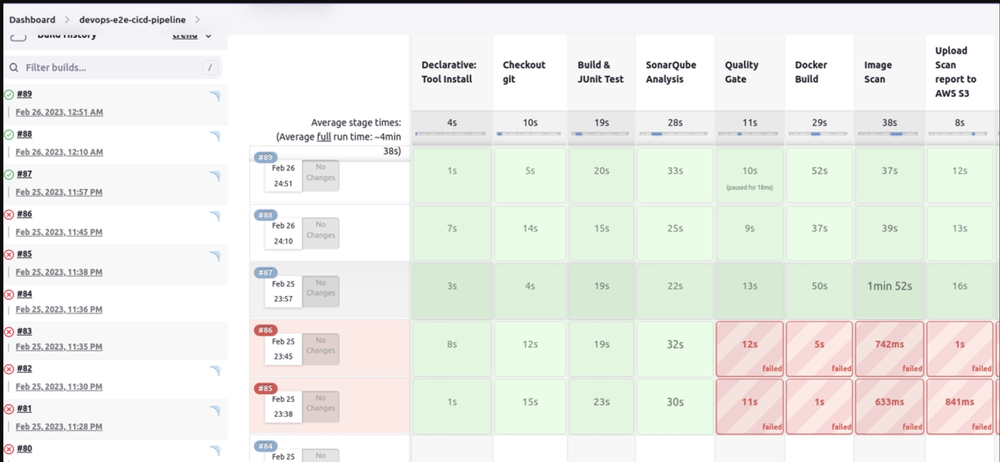

# DevSecOps - CI/CD Pipeline

**Project Description:**
In today's software development landscape, security and continuous integration/continuous deployment (CI/CD) have become paramount. The "DevSecOps CI/CD Pipeline" project is a comprehensive solution that ensures the seamless integration of security practices into the development and deployment pipeline. Leveraging key technologies like Java, Maven, Git, Jenkins, Trivy, SonarQube, Docker, HashiCorp Vault, and Slack, this project is designed to elevate the security, quality, and efficiency of software development and delivery.

**Key Components:**

1. **Java and Spring Boot**: The project is built on a foundation of Java and Spring Boot, ensuring the scalability and maintainability of our applications.

2. **Maven**: Maven is utilized for streamlined build automation and dependency management, guaranteeing consistency across the software development process.

3. **Git**: Git serves as our version control system, fostering collaboration and code management among team members.

4. **Jenkins**: Jenkins, our automation server, orchestrates the entire CI/CD pipeline, automating build, test, and deployment processes.

5. **Trivy**: As a vulnerability scanner, Trivy is instrumental in identifying and mitigating security issues within our containerized applications.

6. **SonarQube**: SonarQube's code quality and security analysis capabilities provide continuous feedback to developers, promoting code that is both robust and secure.

7. **Docker**: Docker containers are pivotal in packaging and distributing our applications, ensuring consistency between development and production environments.

8. **HashiCorp Vault**: HashiCorp Vault secures our sensitive information, such as credentials and API keys, with dynamic secrets management.

9. **Slack**: Slack integrates into our pipeline to facilitate real-time communication, notifying stakeholders of pipeline events, and allowing for swift issue resolution.

**Project Goals:**

1. **Continuous Integration**: Automated code integration and build processes to maintain code quality.

2. **Security-Centric Development**: Frequent security scans and continuous feedback to ensure the security of our applications.

3. **Containerized Deployments**: Efficient and consistent deployment of applications through Docker containers.

4. **Secrets Management**: Secure management of sensitive information with HashiCorp Vault.

5. **Real-time Communication**: Instant notifications and reporting via Slack, ensuring transparency and quick issue resolution.

The "DevSecOps CI/CD Pipeline" project aligns development, security, and operations teams to create a unified, efficient, and secure pipeline that facilitates the delivery of high-quality software. This project not only streamlines the development process but also safeguards the application against potential security threats, thus providing a robust and secure foundation for software deployment.

### Architecture

Pipeline flow:
1.	Jenkins will fetch the code from the remote repo
2.	Maven will build the code, if the build fails, the whole pipeline will become a failure and Jenkins will notify the user If build success then
3.	Junit will do unit testing, if the application passes test cases then will go to the next step otherwise the whole pipeline will become a failure Jenkins will notify the user that your build fails.
4.	SonarQube scanner will scan the code and will send the report to the SonarQube server, where the report will go through the quality gate and give the output to the web Dashboard. In the quality gate, we define conditions or rules like how many bugs vulnerabilities, or code smells should be present in the code. Also, we have to create a webhook to send the status of quality gate status to Jenkins. If the quality gate status becomes a failure, the whole pipeline will become a failure then Jenkins will notify the user that your build fails.
5.	After the quality gate passes, Docker will build the docker image. if the docker build fails the whole pipeline will become a failure and Jenkins will notify the user that your build fails.
6.	Trivy will scan the docker image, if it finds any Vulnerability then the whole pipeline will become a failure, and the generated report will be sent to s3 for future review and Jenkins will notify the user that your build fails.
7.	After trivy scan docker images will be pushed to the docker hub, if the docker fails to push docker images to the docker hub then the pipeline will become a failure and Jenkins will notify the user that your build fails.

## Outputs :
### 1. Successful installations of PostgreSQL, SonarQube, Jenkins, Docker CE and Vault on Ubuntu system + Links

**- Jenkins**  - https://pkg.origin.jenkins.io/debian/

**- Sonar	Qube**  - https://www.fosstechnix.com/how-to-install-sonarqube-on-ubuntu-22-04-lts/ 

**- PostgresSQL** https://www.digitalocean.com/community/tutorials/opening-a-port-on-linux

**Docker** https://docs.docker.com/engine/install/ubuntu/#set-up-the-repository

**Hashicorp Vault** https://www.cyberithub.com/how-to-install-hashicorp-vault-on-ubuntu-20-04-lts/

**Trivy** https://aquasecurity.github.io/trivy/v0.40/getting-started/installation/

### 2. Integration of Hashicorp Vault, SonarQube, DockerHub, Kubernetes and Slack integration with Jenkins.
### 3. Jenkins Pipeline creation.

General Jenkins declarative Pipeline Syntax -

pipeline {
    agent any
    tools {
        maven 'apache-maven-3.0.1' 
    }
    stages {
        stage('Example') {
            steps {
                sh 'mvn --version'
            }
        }
    }
}

Stage 1 : Git Checkout

stage('Checkout git') {
     steps {
	git branch: 'main', url: 'https://github.com/nholuongut/DevSecOps-CI-CD-Pipeline'
  }
}

Stage 2 : Build & JUnit Test

stage ('Build & JUnit Test') {
	steps {
		sh 'mvn install' 
	}
	post {
	    success {
		   junit 'target/surefire-reports/**/*.xml'
		} 
	}
}

Stage 3: SonarQube Analysis

stage('SonarQube Analysis'){
	steps{
	    withSonarQubeEnv('SonarQube-server') {
		sh 'mvn clean verify sonar:sonar \
		-Dsonar.projectKey=devsecops-project-key \
		-Dsonar.host.url=$sonarurl \
		-Dsonar.login=$sonarlogin'
		}
	}
}

Stage 4: Search for waitForQualityGate: Wait for SonarQube analysis to be completed and return quality gate status

stage("Quality Gate") {
            steps {
                waitForQualityGate abortPipeline: true
            }
          }
          
 Stage 5:
 
 stage('Docker Build') {
      steps {
           sh 'docker build -t adv333/salonservice:latest.$BUILD_ID .'
           sh 'docker image tag adv333/salonservice:latest.$BUILD_ID adv333/salonservice:latest'
	}
}

Stage 6:

stage('Image Scan') {
	steps {
	sh ' trivy image --format template --template "@/usr/local/share/trivy/templates/html.tpl" -o report.html adv333/salonservice:latest '
	}
}

Stage 7: Upload report generated by trivy to AWS S3
 
## Outputs

Sonarqube - 

Jenkins -

Docker -

Trivy report uploaded to S3-

### [Contact an Author]
* [Name: nho Luong]
* [Skype](luongutnho_skype)
* [Github](https://github.com/nholuongut/)
* [Linkedin](https://www.linkedin.com/in/nholuong/)
* [Email Address](luongutnho@hotmail.com) 

